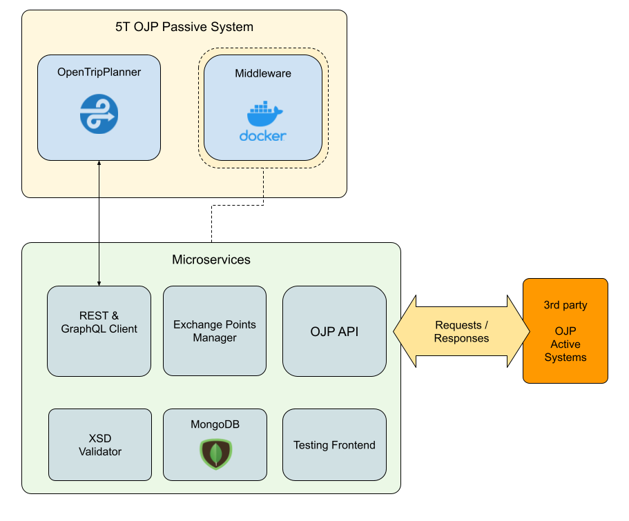

# OJP/OTP Middleware

[Open API for distributed Journey Planning](https://github.com/VDVde/OJP) to [OpenTripPlanner](https://github.com/opentripplanner) Middleware as a OJP Passive System.

The project is structured as a Monorepo that implements Docker microservices.

## Documentation

[Main Docs](docs/README.md)
- [Modules](docs/modules.md)
- [Services](docs/services.md)
- [Config](docs/config.md)

## References

OJP standard: [CEN/TS 17118:2017](https://standards.cen.eu/dyn/www/f?p=204:110:0::::FSP_LANG_ID,FSP_PROJECT:25,62236&cs=1B542F8CC8406A0BD65B6937689DD7740)

API XSD schemas: https://github.com/VDVde/OJP

[OpenTripPlanner](https://github.com/opentripplanner)

## System Architecture



## Setup

### quick start

```bash
docker-compose up -d testss
```

### API tester

Inside ```/tests``` a web application has been implemented which facilitates single service testing process
