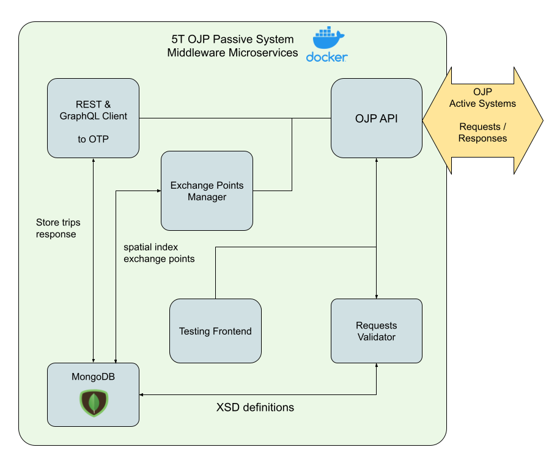

# OJP/OTP Middleware

[Open API for distributed Journey Planning](https://github.com/VDVde/OJP) to [OpenTripPlanner](https://github.com/opentripplanner) Middleware as a OJP Passive System.

The project is structured as a Monorepo that implements Docker microservices.

*Support [OpenTripPlanner Openmove fork >= 1.5.4](https://github.com/openmove/OpenTripPlanner)*

*Legacy Support Official OpenTripPlanner 1.5.0 [this branch](https://github.com/openmove/ojp-middleware/tree/legacy-otp-v1.5.0)*

Since release [v1.6.0](https://github.com/openmove/ojp-middleware/tree/v1.6.0) all services are based on Docker Node Alpine 16.x images.

## Documentation

[Main Docs](docs/README.md)
- [Modules](docs/modules.md)
- [Services](docs/services.md)
- [Config](docs/config.md)

[PDF](Documentation.pdf)

## References

OJP standard: [CEN/TS 17118:2017](https://standards.cen.eu/dyn/www/f?p=204:110:0::::FSP_LANG_ID,FSP_PROJECT:25,62236&cs=1B542F8CC8406A0BD65B6937689DD7740)

[OJP XSD schemas](https://github.com/VDVde/OJP)

[OpenTripPlanner](https://github.com/opentripplanner)


### Quick start

```bash
docker-compose up -d tests
```

### API tester

Inside ```/modules/tests``` a web application has been implemented which facilitates single service testing process


## System Architecture


### Modules Details




