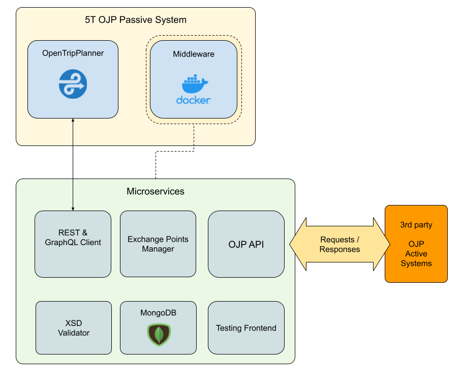

# OJP Middleware Documentation

## Architecture macro OJP



## Architecture detail microservices


## Structure

Common structure for modules and services is:
- config.yml
- index.js
- package.json

and for services is:
- Dockerfile
- env.example(renamed to .env in dev environment)


The basic structure of code:
```
.
├── modules
│   ├── api-ojp
│   │   ├── config.yml
│   │   ├── Dockerfile
│   │   ├── env.example
│   │   ├── index.js
│   │   ├── package.json
│   │   └── services
│   ├── api-otp
│   │   ├── config.yml
│   │   ├── Dockerfile
│   │   ├── env.example
│   │   └── package.json
│   ├── ep-manager
│   │   ├── config.yml
│   │   ├── Dockerfile
│   │   ├── download/
│   │   ├── env.example
│   │   ├── import/
│   │   └── package.json
│   ├── ojp-loader
│   │   ├── config.yml
│   │   ├── download/
│   │   ├── env.example
│   │   ├── import/
│   │   ├── index.js
│   │   ├── package.json
│   │   └── xsd-schemas/
│   ├── utils
│   │   ├── config.js
│   │   ├── index.js
│   │   └── package.json
│   └── xsd2json
│       ├── config.yml
│       ├── Dockerfile
│       ├── env.example
│       ├── index.js
│       └── package.json
├── lerna.json
├── docker-compose.yml
└── package.json
```

## Modules

all modules are single npm packages some are dependent on each other

- api-ojp
- api-otp
- ep-manager
- ojp-loader
- utils
- xsd2json

[learn more](modules.md)

## Services

some of modules implement a Docker service running in individual container 
and associated with a specific port to an Api REST interface.

*docker-compose.yml* this sets up the infrastructure to make these services interact

- api-ojp
- api-otp
- ep-manager
- ojp-loader
- xsd2json

[learn more](services.md)

## References

OJP general api docs:
https://github.com/VDVde/OJP/tree/markdowns


api requests/response docs:

https://vdvde.github.io/OJP/generated/OJP.html
